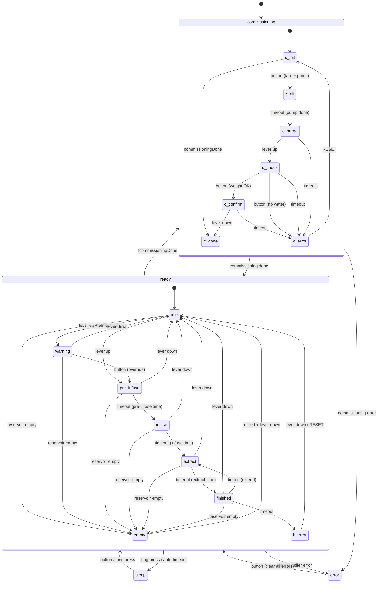
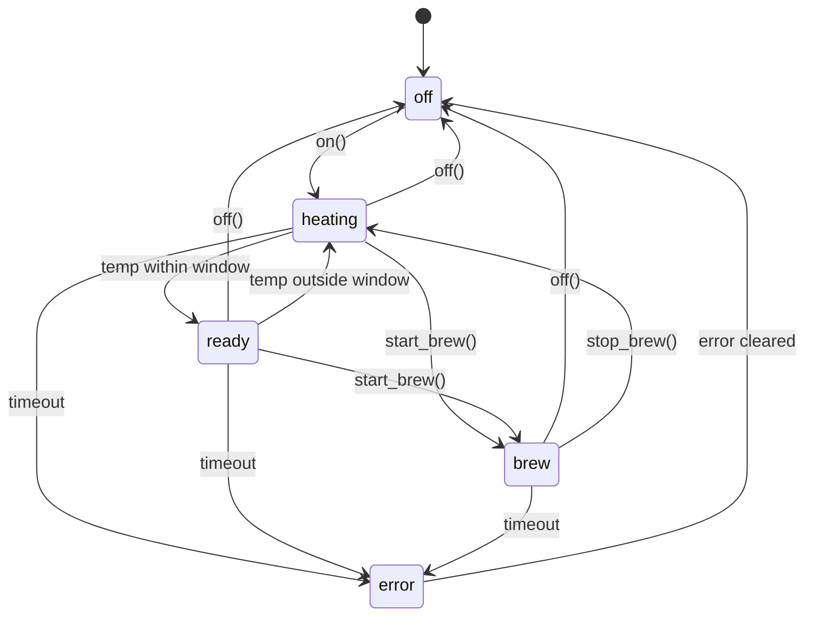

# diyPresso State Machines

## Machine Controller + Sub-FSMs

The MachineController is the top-level orchestrator. It dispatches to the CommissioningProcess
and BrewProcess sub-FSMs in the `commissioning` and `ready` states respectively.

## Boiler Controller

The BoilerStateMachine runs independently as a peer controller (PID + safety).

