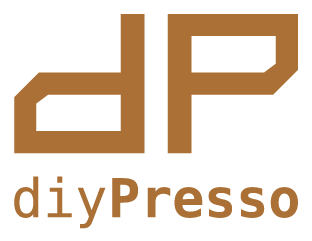
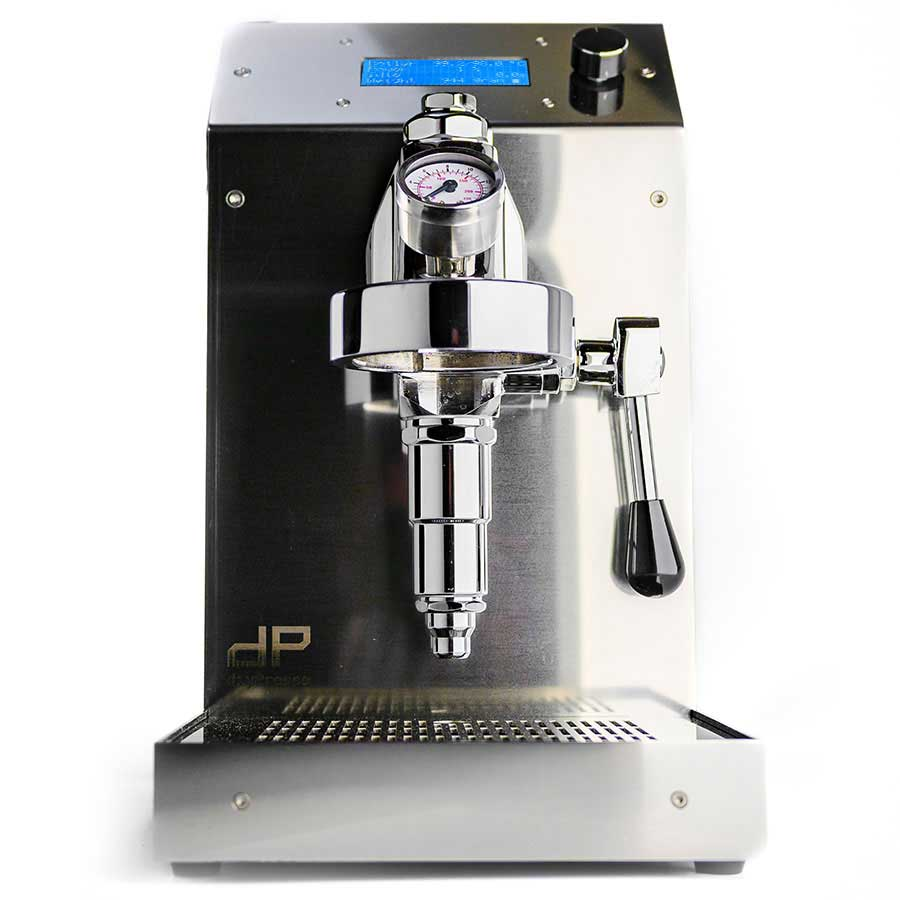
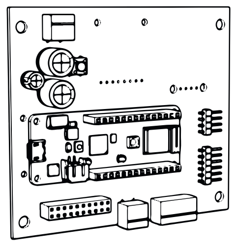
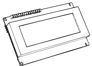
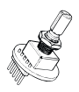
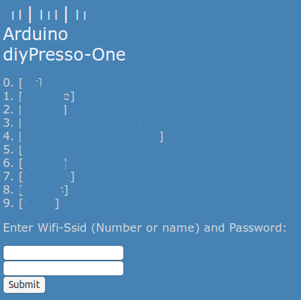

 

[www.diyPresso.com](https://www.diyPresso.com) world's first DIY espresso machine open source software





## Hardware

This repository contains the code for the diyPresso One (arduino) control board with an 4x20 LCD display and rotary encoder.






## Software

(Tested) releases of the firmware can be found 
[here](https://github.com/diyPresso/diyPresso-One/releases)


## Functions
* Commissioning (initial filling of boiler)
* Settings (with EEPROM retention)
* Basic brewing
* Wifi setup
* MQTT communication


## Factory Reset
*  Holding the rotary encoder button WHEN POWERING ON the machine will reset all settings to default values (including the "WiFo Modi" setting). Wifi credential (AP name and password are not stored on the main CPU, but on the WiFi chip, these settings are retained when the firmware is updated or a factory reset is executed.
* When the software is flashed, this will also erase all EEPROM settings (preferences) and you need to re-execute the commissioning steps.
* Enabling the "CONFIG-AP" mode will erase previously configured WiFi credentials


## Wifi Configuration
* Wifi settings can be chaged by setting the "WIFI MODE" setting to "CONFIG-AP" (Configuration Access Point), then SAVE setting and REBOOT the machine . This will create  ad "diyPresso-One" Wifi access point that you can connect to with your phone or laptop.
* Your browser should open a "hotspot" login page where you can enter your Wifi credentials. if not: point your browser to [http://192.168.11.1/
](http://192.168.11.1/)
* Enter the number of your network and the `[SUBMIT]` button.




## Development

The software is written for an Arduino [mkr1010](https://docs.arduino.cc/hardware/mkr-wifi-1010/) board with WiFi. The [Arduino development environment](https://docs.arduino.cc/software/ide/) is to be used to compile and upload the software to the board. Some additional libraries need to be installed. See the [diyp-controler source](diyp-controller/diyp-controller.ino) for more information.

In addition the code should compile with [PlatformIO](https://piolabs.com/). On linux you can perform a compilation and upload with the following command:

```pio run -t upload --upload-port=/dev/ttyACM0```

You may also use [ArduinoCLI](https://arduino.github.io/arduino-cli/1.0/), but the recipe is not included yet...


## Branches and tags

The ```main``` branch is used for development and
```release``` is used for tested releases. They are tagged with a semver and the releases are published [here](https://github.com/diyPresso/diyPresso-One/releases). Use [topic branches](https://git-scm.com/book/en/v2/Git-Branching-Branching-Workflows) for your work on new features and bugs. Use the name ```issue_[xx]_[description]``` for this.


## (Code) Contributions

You can clone this repo, create [topic branches](https://git-scm.com/book/en/v2/Git-Branching-Branching-Workflows) for your work and make [pull-requests](https://github.com/diyPresso/diyPresso-One/pulls). Make sure your branch merges cleanly with the main branch.

## Issues

If you find any bugs, or have ideas for new features, please use github [issues](https://github.com/diyPresso/diyPresso-One/issues) to submit these.

Also, feel free to test topic branches, reproduce bufgs and comment on issues to assist development.

## ToDo
* ~~Create ```platformio.ini```~~
* Build with docker container
* Setup CI in gitub
* OTA updates
* Refactor Wifi code (use other library?)
* MQTT credentials setup
* Remote wakeup (via MQTT)
* Support for graphical color display
* Advanced brewing recipes (more steps)
* Brewing recipe storage and retrieval
* Extracted volume weight sensor (and volume based steps)
* Pressure sensor integration
